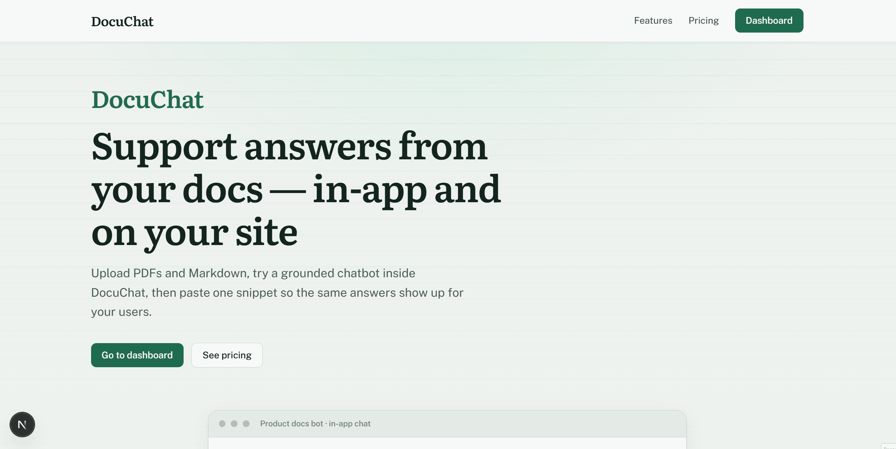

# DocuChat

**Clean, embeddable RAG chatbot widget SaaS powered by Next.js, Supabase (pgvector), and TypeScript.**

Upload your product docs, chat with them inside the app, then embed one script on your website so visitors get the same grounded answers. This repository is a complete, launchable **MVP** — real ingest, real retrieval, a public widget, and Stripe **test-mode** billing. There are no live payments anywhere in the codebase.

## Badges


## Demo



The capture walks the full product: the dashboard, a grounded chat conversation, the same bot embedded as a widget on a sample site, the billing page, and subscription management through the Stripe Customer Portal (test mode).

## Key features

- **Embeddable widget** — a single `<script>` tag with a `data-bot` attribute injects a floating launcher and an iframe chat panel (`public/widget.js`, vanilla JS — no framework required on your site).
- **RAG over your docs** — query embeddings are searched against Supabase **pgvector** (768-dim) via a `match_chunks` RPC; only the top relevant chunks are sent to the LLM.
- **Fast streaming answers** — chat responses stream as Server-Sent Events (`text/event-stream`) from Gemini; the in-app chat and the widget share the exact same pipeline.
- **Grounded, honest replies** — the model answers only from retrieved chunks and explicitly says it does not know when retrieval returns nothing.
- **Upload and index** — `.pdf`, `.md`, and `.txt` files are extracted, chunked, embedded, and stored in Supabase Storage + Postgres.
- **Customizable per bot** — welcome message, system prompt, name, and widget branding (removable on paid plans).
- **Server-side plan gates** — bot count, monthly messages, and storage are enforced in `lib/plans.ts` and usage quotas. The client can never write `profiles.plan`.
- **Stripe test-mode billing** — Checkout and the Customer Portal with webhook fulfillment into `subscriptions` / `profiles.plan`.

## Tech stack & architecture

| Layer | Technology |
| --- | --- |
| Frontend | Next.js 16 (App Router), React 19, TypeScript (strict), Tailwind CSS v4 + design tokens |
| Backend | Next.js API Routes + Server Actions; anon-key client under RLS, server-only service-role client for ingest |
| Database | Supabase Postgres with row-level security, **pgvector** (768-dim), Storage, Auth |
| AI / LLM | Google Gemini — embeddings (`gemini-embedding-001`) + streaming chat (`gemini-3.6-flash`) |
| Billing | Stripe test mode — Checkout, Customer Portal, webhooks |
| Tests | Vitest 4 + Testing Library (297 tests) |

### RAG flow

In-app chat and the embeddable widget run through the same path; they differ only in auth, CORS, and rate limiting:

```
┌──────────────────────────────┐   1. user question
│  Customer site widget        │ ─────────────────────────────▶
│  or in-app chat              │
└──────────────┬───────────────┘
               │
               ▼
┌──────────────────────────────┐
│  Next.js API Route           │
│  /api/chat (signed in) or    │
│  /api/widget/chat (public)   │
└──────────────┬───────────────┘
               │ 2. embed the question
               ▼
┌──────────────────────────────┐
│  Gemini embeddings           │
│  gemini-embedding-001        │
└──────────────┬───────────────┘
               │ 3. top-k similarity search
               ▼
┌──────────────────────────────┐
│  Supabase pgvector           │
│  match_chunks RPC (top 8)    │
└──────────────┬───────────────┘
               │ 4. chunks + system prompt
               ▼
┌──────────────────────────────┐
│  Gemini streaming            │
│  gemini-3.6-flash            │
└──────────────┬───────────────┘
               │ 5. SSE deltas (text/event-stream)
               ▼
               Client
```

Document ingest follows the same pipeline in reverse: upload → Storage → extract text (`unpdf`) → chunk → embed (retrieval document) → insert into `chunks`.

## Getting started

### Prerequisites

- **Node.js 20+** and npm
- A **Supabase** project (free tier is fine)
- A **Google AI Studio** API key for Gemini
- **Stripe** test keys + the Stripe CLI — only needed for billing flows; the rest of the app works without them

### Local setup

1. Install dependencies:

   ```bash
   npm install
   ```

2. Copy the environment template and fill it in:

   ```bash
   cp .env.example .env.local
   ```

   Required keys:

   | Variable | Notes |
   | --- | --- |
   | `NEXT_PUBLIC_SUPABASE_URL` | Your Supabase project URL |
   | `NEXT_PUBLIC_SUPABASE_PUBLISHABLE_KEY` | Prefer the publishable key; anon JWT still accepted as fallback |
   | `NEXT_PUBLIC_SUPABASE_ANON_KEY` | Legacy anon key (fallback) |
   | `SUPABASE_SERVICE_ROLE_KEY` | **Server-only** — never expose it to the browser |
   | `GEMINI_API_KEY` | Google AI Studio key for embeddings + chat |
   | `NEXT_PUBLIC_APP_URL` | Public origin for the embed snippet src, no trailing slash (usually `http://localhost:3000`) |
   | `STRIPE_SECRET_KEY` | Stripe **test** secret key |
   | `STRIPE_WEBHOOK_SECRET` | Signing secret printed by `stripe listen` (see below) |
   | `NEXT_PUBLIC_STRIPE_PUBLISHABLE_KEY` | Stripe test publishable key |
   | `STRIPE_PRICE_PRO` / `STRIPE_PRICE_BUSINESS` | Test-mode price IDs for the Pro and Business plans |

   Never commit `.env.local`.

3. Apply the SQL in [`supabase/migrations/`](supabase/migrations/) to your Supabase project. The schema creates `profiles`, `bots`, `documents`, `chunks` (vector 768), conversations/messages, RLS policies, quota RPCs, and the `match_chunks` search function; the first migration enables the `vector` extension.

4. Create a **private** Storage bucket named `documents` (files are served through the server, never from a public bucket URL).

5. In **Supabase Auth → Providers → Email**, turn **Confirm email** off for a smooth local demo (signup returns a session immediately).

6. Run the app:

   ```bash
   npm run dev
   ```

   Then open [http://localhost:3000](http://localhost:3000).

7. For billing to update after Checkout, forward webhooks in a second terminal:

   ```bash
   stripe listen --forward-to localhost:3000/api/stripe/webhook
   ```

   Copy the `whsec_...` signing secret printed by the CLI into `STRIPE_WEBHOOK_SECRET` and restart the dev server. Use Stripe's test card. Without `stripe listen`, Checkout can succeed but the plan stays Free.

Optional verification:

```bash
npm run lint
npm run build
```

## How to embed the widget

No React or build step required on your site — paste this just before the closing `</body>`:

```html
<script
  src="https://your-deployment.example.com/widget.js"
  data-bot="YOUR_BOT_PUBLIC_ID"
  async
></script>
```

- `data-bot` is the bot's `public_id`, shown on the bot's **Embed** page in the app.
- `widget.js` reads the `data-bot` attribute, then injects a floating launcher button and an iframe pointing to `/w/{publicId}/embed` on your deployment origin. Chat runs inside that iframe against `/api/widget/chat` (CORS-enabled and rate-limited per visitor IP). Because the script resolves its origin from `script.src`, the same snippet works in localhost and in production.

In a React / Next.js app, the same launcher mounts with `next/script`:

```tsx
import Script from "next/script";

export function SupportWidget({ publicId }: { publicId: string }) {
  return (
    <Script
      src="https://your-deployment.example.com/widget.js"
      strategy="afterInteractive"
      data-bot={publicId}
    />
  );
}
```

The Free plan shows a "Powered by DocuChat" badge in the widget; Pro and Business can hide it.

## Plans

| | Free | Pro | Business |
| --- | --- | --- | --- |
| Price (demo) | $0 | $29 / mo (test) | $99 / mo (test) |
| Bots | 1 | 5 | 20 |
| Messages / month | 100 | 2,000 | 10,000 |
| Doc storage | 10 MB | 200 MB | 1 GB |
| Widget badge | Shown | Can hide | Can hide |

Limits are enforced on the server (`lib/plans.ts` + usage quotas); the client cannot change `profiles.plan`.

## Testing

The suite runs on [Vitest](https://vitest.dev) with Testing Library (happy-dom) for components:

```
npm run test            # single pass
npm run test:watch      # watch mode
npm run test:coverage   # coverage report + thresholds
```

- **lib/** — RAG pipeline, usage quotas, billing/stripe helpers, pure utilities (fake Supabase client in `tests/helpers/fake-supabase.ts`)
- **app/api/** — route handlers including SSE streaming and real Stripe signature verification
- **actions/** — server actions with mocked `next/navigation` redirects
- **components/** — interactive UI (forms, uploader, composer, widget panel)

Coverage thresholds: global lines ≥ 65%, `lib/` lines ≥ 80%.

## Project layout

```
app/                 Routes (landing, auth, dashboard, bots, chat, billing, public widget)
actions/             Server Actions (auth, bots, documents, billing)
components/          React components (forms, chat UI, widget panel, embed snippet)
lib/                 Supabase clients, Gemini, RAG, plans, usage, Stripe
public/widget.js     Embed launcher for customer sites (vanilla JS)
supabase/migrations/ Schema, RLS, RPCs
tests/               Shared test helpers
assets/              README media (demo.gif)
```

## Scope

- **Gemini only** — embeddings and chat use Google Gemini; OpenAI/OpenRouter are not used.
- **Stripe test mode only** — no live charges, no production webhooks.
- No team seats / SSO; single-owner workspaces.

## License

Released under the [MIT License](LICENSE) — shared as a portfolio piece, feel free to learn from it.
