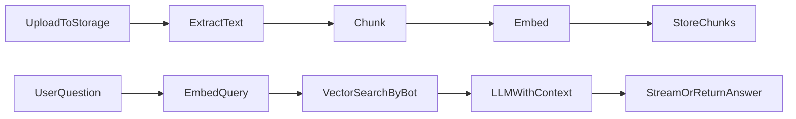

# Architecture

## Stack

| Layer | Tool | Purpose |
| --- | --- | --- |
| Framework | Next.js App Router | Full-stack UI + API |
| Auth | Supabase Auth | Email/password and/or OAuth |
| Database | Supabase Postgres + RLS | App data |
| Vectors | pgvector | Chunk embeddings + similarity search |
| Storage | Supabase Storage | Uploaded docs |
| AI | Google Gemini API | `gemini-embedding-001` (768-d) + `gemini-2.5-flash` |
| Billing | Stripe test mode | Checkout + webhooks → plan |
| Styling | Tailwind + design tokens | UI |
| Language | TypeScript strict | Throughout |

**No InsForge.** Do not add `@insforge/sdk` or call InsForge MCP. **No OpenAI** for chatbot/embeddings — Gemini only.

---

## Folder Structure (target)

```
/
├── AGENTS.md
├── PRODUCT.md
├── DESIGN.md                    → after /impeccable init (optional until then)
├── context/
│   ├── project-brief.md
│   ├── project-overview.md
│   ├── architecture.md
│   ├── ui-tokens.md
│   ├── ui-rules.md
│   ├── ui-registry.md
│   ├── code-standards.md
│   ├── library-docs.md
│   ├── build-plan.md
│   └── progress-tracker.md
├── app/
│   ├── layout.tsx
│   ├── page.tsx                 → Landing
│   ├── (auth)/
│   │   ├── login/page.tsx
│   │   └── signup/page.tsx
│   ├── (app)/
│   │   ├── layout.tsx           → Navbar + shell
│   │   ├── dashboard/page.tsx
│   │   ├── bots/
│   │   │   ├── page.tsx
│   │   │   ├── new/page.tsx
│   │   │   └── [id]/
│   │   │       ├── page.tsx     → settings, docs, embed
│   │   │       └── chat/page.tsx
│   │   └── settings/billing/page.tsx
│   ├── w/[publicId]/page.tsx    → optional hosted preview
│   └── api/
│       ├── chat/route.ts        → authenticated in-app chat
│       ├── ingest/route.ts      → start/process document ingest
│       ├── widget/chat/route.ts → public embed chat (CORS)
│       └── stripe/
│           ├── checkout/route.ts
│           └── webhook/route.ts
├── actions/                     → Server Actions (bots, docs, billing helpers)
├── components/
│   ├── ui/
│   ├── landing/
│   ├── layout/
│   ├── bots/
│   ├── chat/
│   └── billing/
├── lib/
│   ├── supabase/client.ts
│   ├── supabase/server.ts
│   ├── supabase/admin.ts        → service role (server only)
│   ├── gemini.ts
│   ├── rag/chunk.ts
│   ├── rag/embed.ts
│   ├── rag/retrieve.ts
│   ├── plans.ts                 → Free/Pro/Business limits
│   └── stripe.ts
├── public/
│   └── widget.js                → embeddable script (or built bundle)
└── supabase/
    └── migrations/              → SQL: tables, RLS, vector, RPCs
```

---

## Data Model (sketch)

### `profiles`

| Column | Type | Notes |
| --- | --- | --- |
| id | uuid PK | = `auth.users.id` |
| email | text | |
| plan | text | `free` \| `pro` \| `business` |
| stripe_customer_id | text nullable | |
| stripe_subscription_id | text nullable | |
| messages_used_month | int | reset monthly |
| messages_reset_at | timestamptz | |
| created_at | timestamptz | |

### `bots`

| Column | Type | Notes |
| --- | --- | --- |
| id | uuid PK | |
| user_id | uuid FK | owner |
| name | text | |
| system_prompt | text | |
| welcome_message | text | |
| public_id | text unique | embed identifier |
| remove_branding | bool | gated by plan |
| created_at | timestamptz | |

### `documents`

| Column | Type | Notes |
| --- | --- | --- |
| id | uuid PK | |
| bot_id | uuid FK | |
| user_id | uuid FK | |
| filename | text | |
| storage_path | text | |
| mime_type | text | |
| byte_size | int | |
| status | text | `pending` \| `processing` \| `ready` \| `failed` |
| error | text nullable | |
| created_at | timestamptz | |

### `chunks`

| Column | Type | Notes |
| --- | --- | --- |
| id | uuid PK | |
| document_id | uuid FK | |
| bot_id | uuid FK | for filtered retrieval |
| content | text | |
| embedding | vector(768) | Gemini `gemini-embedding-001` with `output_dimensionality: 768` |
| token_count | int | |
| created_at | timestamptz | |

### `conversations` / `messages`

| Table | Purpose |
| --- | --- |
| conversations | `id`, `bot_id`, `user_id` nullable (null for widget visitors), `source` (`app` \| `widget`), timestamps |
| messages | `id`, `conversation_id`, `role` (`user` \| `assistant`), `content`, `created_at` |

### `subscriptions` (optional if mirrored on profiles)

Store Stripe subscription status, price id, current period end for portal / gating.

---

## RLS

- `profiles`: user can read/update own row
- `bots`, `documents`, `chunks`, `conversations` (app): owner `user_id = auth.uid()`
- Widget path: **no** end-user JWT — Route Handler uses service role after validating `public_id`, rate limits, and plan quotas; never expose service role to the browser
- Storage bucket `documents`: authenticated upload only under `{user_id}/...`

---

## RAG Pipeline



1. **Ingest** (`/api/ingest` or background after upload): parse PDF/text → chunk (~500–800 tokens, overlap) → embed → insert `chunks`; set document `ready` / `failed`.
2. **Retrieve**: embed question → `match_chunks(bot_id, query_embedding, k)` RPC → top-k texts.
3. **Generate**: system prompt + retrieved context + user message → chat completion. Prefer streaming for in-app UI.

---

## Embed Widget

- Snippet loads `widget.js` with `data-bot` = `public_id`.
- Script injects a floating button + chat panel (iframe or shadow DOM).
- Posts to `/api/widget/chat` with CORS allowlist or `*` for demo plus rate limiting.
- Same RAG path as in-app chat; increments owner’s monthly message usage.

---

## Billing Flow

1. User opens `/settings/billing`, chooses Pro/Business.
2. Server creates Stripe Checkout Session (test mode) with metadata `user_id`, `plan`.
3. Webhook `checkout.session.completed` / `customer.subscription.*` updates `profiles.plan`.
4. Gates in Server Actions / API check `lib/plans.ts` before create-bot, ingest, chat.

---

## Auth & Middleware

- `@supabase/ssr` middleware refreshes cookies on matched routes.
- Protect `/dashboard`, `/bots`, `/settings/*`.
- Landing and `/api/widget/*` remain public.

---

## Env Vars (expected)

```
NEXT_PUBLIC_SUPABASE_URL=
NEXT_PUBLIC_SUPABASE_ANON_KEY=
SUPABASE_SERVICE_ROLE_KEY=
GEMINI_API_KEY=
STRIPE_SECRET_KEY=
STRIPE_WEBHOOK_SECRET=
NEXT_PUBLIC_STRIPE_PUBLISHABLE_KEY=
STRIPE_PRICE_PRO=
STRIPE_PRICE_BUSINESS=
NEXT_PUBLIC_APP_URL=
```
